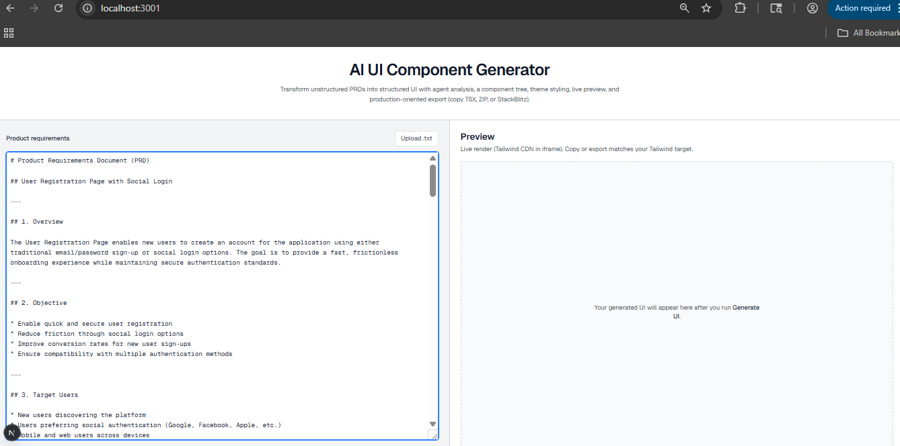
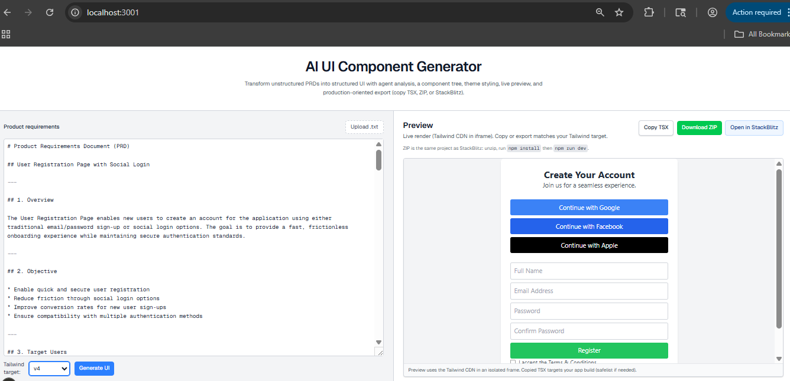
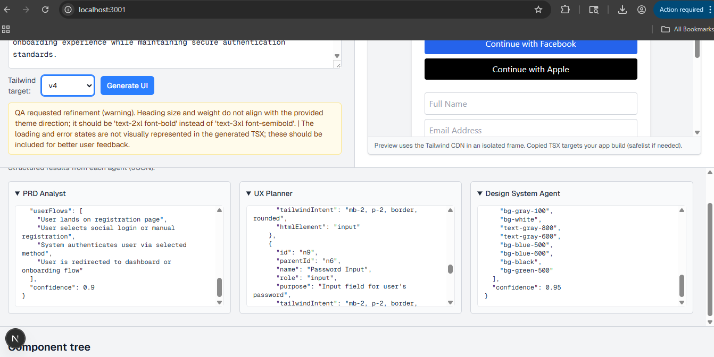
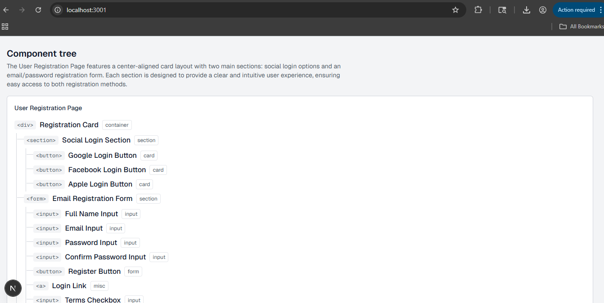
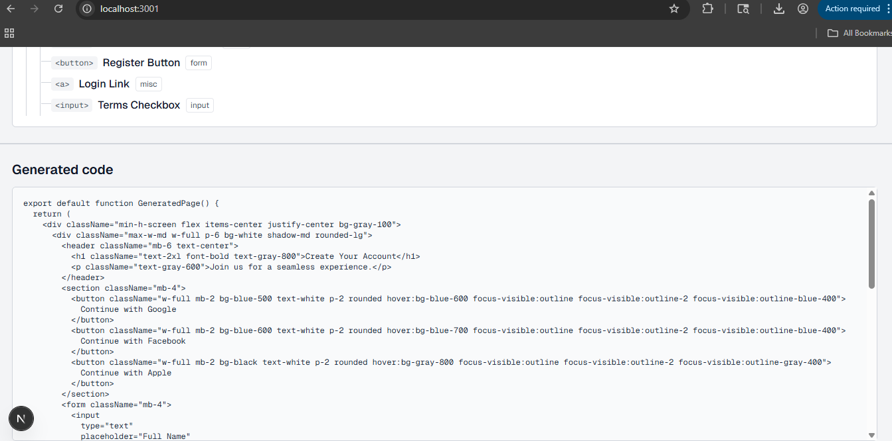
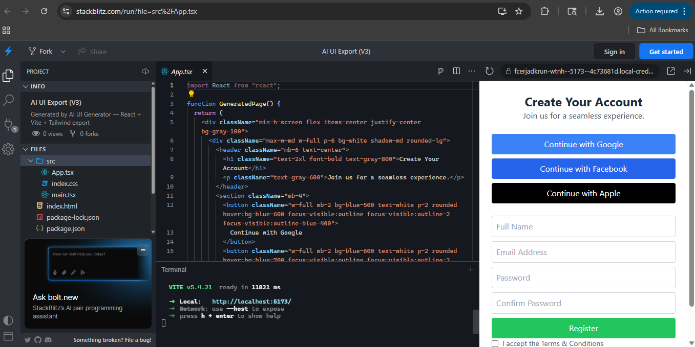

# SpecToUI Agent

## Problem statement
Modern product teams rely on PRDs to define features, but converting these documents into working UI remains a manual, time-consuming process. Developers must interpret requirements, design layouts, structure component hierarchies, and implement styling from scratch. This results in delays, inconsistencies across implementations, and reduced productivity—especially in fast-paced environments where rapid iteration is critical.

## Team members and contribution

### Rishiraj CR
**Foundation & Application Skeleton**
- Set up base Next.js project structure and boilerplate
- Created initial UI scaffolding (input, preview container, page layout)
- Added core API route structure and baseline request/response flow
- Built export shell (StackBlitz/ZIP plumbing and project templates)
- Established initial code organization and base documentation

### Jojosh Vincent
- Integrated LLM pipeline and multi-agent orchestration
- Implemented advanced agent flow (analysis -> planning -> design -> generation -> QA)
- Added Redis-backed shared memory/state for pipeline execution
- Introduced guardrails:
  - strict schema contracts
  - retry policies
  - validation checks
  - QA refine/reject loop
- Added streaming progress behavior and reliability fixes
- Expanded test coverage for pipeline, API streaming, schemas, and exports

## Tech stack with versions

### Core
- Next.js `16.2.4`
- React `19.2.4`
- React DOM `19.2.4`
- TypeScript `^5`
- OpenAI SDK `^6.34.0`
- Zod `^4.3.6`
- Redis client `^5.12.1`

### Export / Utilities
- `@stackblitz/sdk` `^1.11.0`
- `jszip` `^3.10.1`

### Styling
- Tailwind CSS `^4`
- `@tailwindcss/postcss` `^4`

### Quality / Tooling
- ESLint `^9`
- `eslint-config-next` `16.2.4`
- Vitest `^4.1.4`

## Project overview
**SpecToUI Agent** converts raw PRDs into export-ready UI code using a multi-agent pipeline.

### End-to-end flow
1. User submits PRD text (paste/upload) and selects Tailwind target (`v4` or `v3`).
2. Backend runs a 5-agent pipeline:
   - PRD Analyst
   - UX Planner
   - Design System Agent
   - UI Generator
   - QA Agent (approve/refine/reject)
3. Pipeline events are streamed to the frontend as NDJSON for live progress updates.
4. Generated UI is previewed in-browser and can be exported as:
   - TSX copy
   - StackBlitz project
   - ZIP (Vite + React template)

### Reliability features
- Strict schema validation between agents
- Retry loops with bounded attempts
- QA-driven refinement routing
- Redis-backed shared pipeline state
- Automated tests for pipeline, API stream, schema contracts, and export behavior

## Setup steps
1. Clone the repository.
2. Install dependencies:
   ```bash
   npm install
   ```
3. Configure environment variables:
   - Create `.env.local`
   - Add:
     ```env
     OPENAI_API_KEY=your_openai_key
     # Optional
     OPENAI_MODEL=gpt-4o-mini
     # Optional (recommended for shared state)
     REDIS_URL=redis://localhost:6379
     ```
4. Ensure Redis is running if you use `REDIS_URL`.

## How to run locally (step by step)
1. Install packages:
   ```bash
   npm install
   ```
2. Add environment variables in `.env.local` (see above).
3. Start dev server:
   ```bash
   npm run dev
   ```
4. Open:
   - `http://localhost:3000`
5. Paste/upload a PRD, click **Generate UI**, and monitor live pipeline progress.
6. Optional quality checks:
   ```bash
   npm run lint
   npm test
   npm run build
   ```

## Additional resources
### Screenshots

#### PRD Input


#### Generated Preview


#### Structured Output


#### Component Tree


#### Generated UI Code


#### StackBlitz Output


### Demo video link
- `https://www.loom.com/share/871436e3ddfc455fbecd968ecd91bb26`
